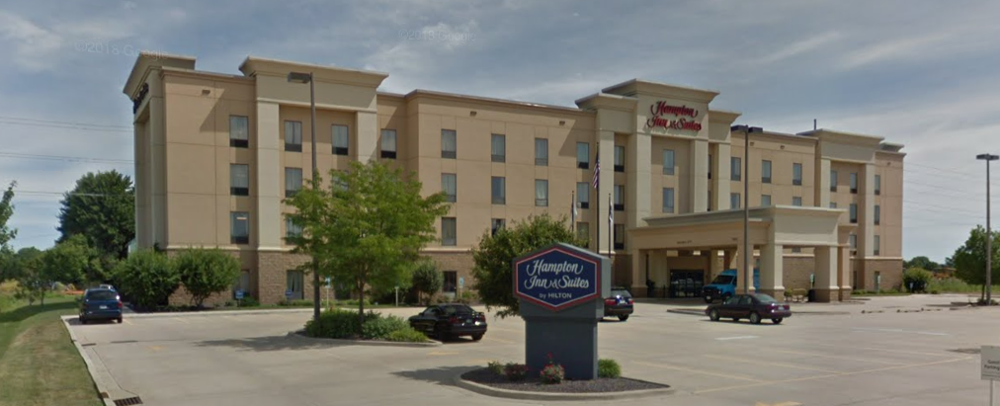
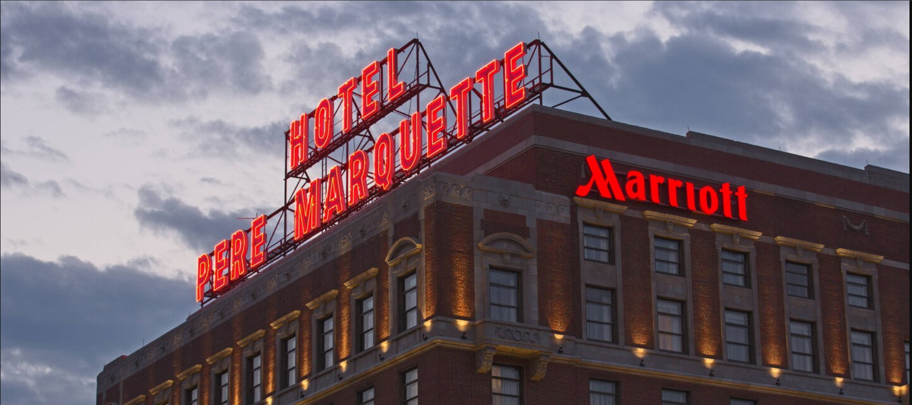

## Guest Accommodations

We've reserved blocks at the following two hotels. We look forward to seeing you!

 

### Hampton Inn & Suites - Grand Prairie

**Address**: 7806 N. Route 91, Peoria, IL 61615

**Phone**: [(309)-589-0001](tel:+13095890001)

**Website**: [www.hamptoninn.com](https://hamptoninn3.hilton.com/en/hotels/illinois/hampton-inn-and-suites-peoria-at-grand-prairie-il-PIEWEHX/index.html)

**Group Code**: `LTW` (Call and book over the phone or book online using this code)

> This hotel is 7 minutes from the church, about 20 minutes from the reception venue, and 5 minutes to the Lueken's home.
> They will provide free shuttle service to and from the wedding reception.
>
> **King Suite**: $157
>
> **King Single**: $137
>
> **Queen Double**: $137
>
> Hotel includes continental breakfast.
> They are also across a parking lot from Double A's - good place for pizza, lunch, bar food.

  

### Marriott Peoria - Pere Marquette

**Address**: 501 Main Street, Peoria, IL 61602

**Phone**: [(800)-410-9914](tel:+18004109914)  (*Just mention that you are with the Lueken/Thurman wedding block*)

**Website**: [www.marriott.com](https://www.marriott.com/events/start.mi?id=1564586840933&key=GRP)

> This hotel is 7 minutes from the reception venue and about 20 minutes from church.
> They will provide free shuttle service to and from the wedding reception.
>
> **Room Rate**: $135 (*until September 27*) 